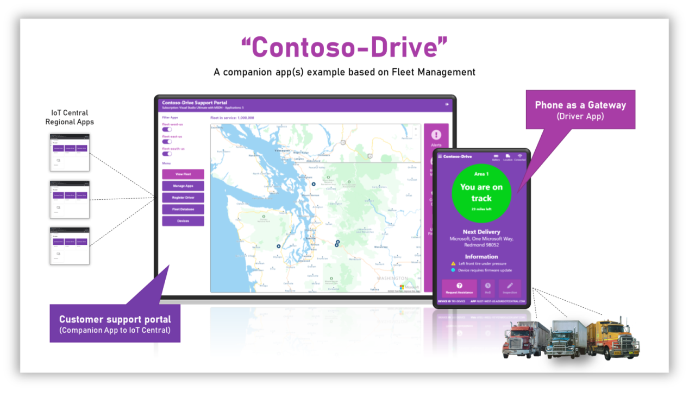
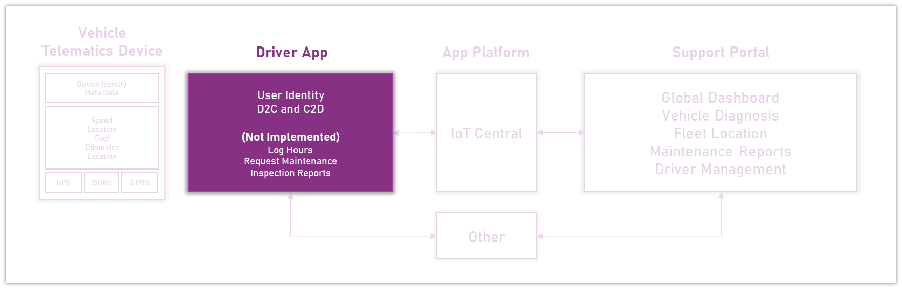
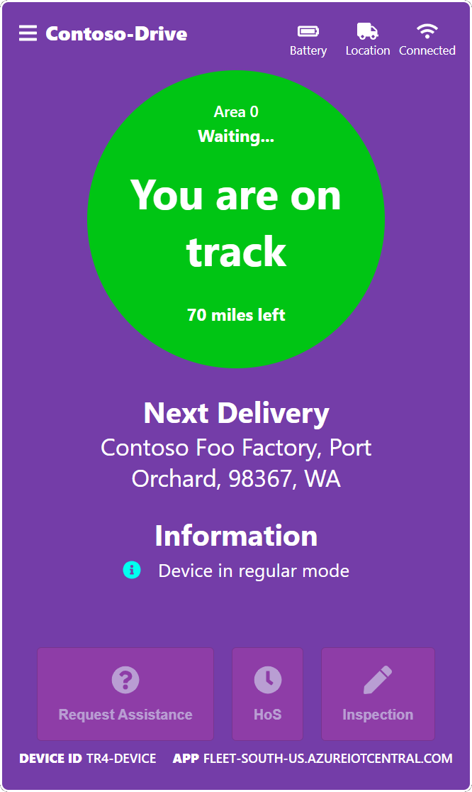
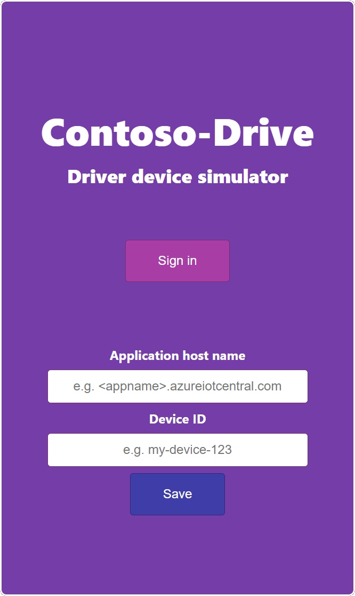
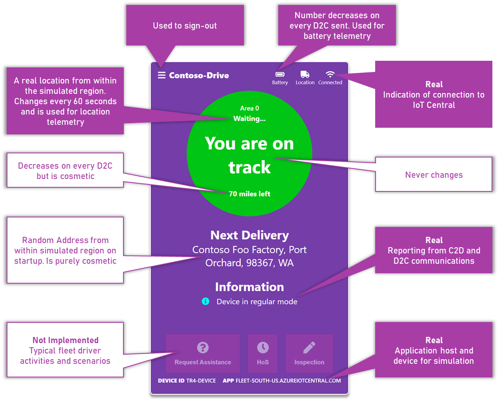

# Contoso-Drive Driver App

Contoso-Drive is an example codebase and demonstration of an IoT Central companion experience. It's a codebase built around Fleet Management scenarios and leverages the Azure IoT Central REST APIs to communicate with the corresponding IoT Central applications.

<p align="center"></p>

[Watch the video here](https://youtu.be/dO_sEZEgpFM)

# Companion experience overview

The Contoso-Drive companion experience is split into three concepts

* __The Support Portal.__ This application is an example of role specific scenarios for the technician/support person of Contoso-Drive. Typically this is a desktop application and is owned, managed and deployed by the Contoso-Drive company. Visit [this](https://github.com/iot-for-all/contoso-drive-support) repo to see the Support Portal.

* __The Driver App.__ This application represents the device that sends the vehicle's telematics to IoT Central which is subsequently available in the Support Portal. Typically this is a phone acting as a gateway and is run on the driver's mobile phone or an internet accessible device.

* __The IoT Central application(s).__ The main experience to manage the Contoso-Drive devices and admin level tasks for Contoso-Drive. It is typically used by the technician/support person and other privileged persons to perform admin level device management, insights and actions.

__This repo represents the Driver App scenario.__ 

<p align="center"></p>

## Learning path

To get up and running with the full Contoso-Drive experience, visit the learning path [here](https://github.com/iot-for-all/learn-iotc-companion-apps). This is the best place to start with Contoso-Drive

# The Driver App codebase

The codebase is a browser based device simulator that mimics some of the telemetry typically sent as vehicle telematics. The driver app is an authenticated experience which allows it to communicate with IoT Central. This also enables expansion into other systems requiring the same identity. To learn more about browser based device simulation visit [this](https://github.com/iot-for-all/iot-central-web-mqtt-device) repro

<p align="center"></p>

# Usage

## Setup

There are a few steps that need to be completed before running the code.

* __Use the Contoso-Drive Support portal application to create and register a user__; 

  If you have not set up the support portal application yet, visit [this](https://github.com/iot-for-all/contoso-drive-support) repo and follow the instructions. Though users can be manually added, the support portal orchestrates all the steps into a single button click.

* __Configure the AAD application__; 

  You will need to have an AAD application so that an authenticated user can be authorized to use IoT Central APIs. If you have setup the support portal already, you can share the same AAD application. If you need to setup a new or different AAD application, use the following repo to guide you [Setting up an AAD application to work with IoT Central](https://github.com/iot-for-all/iotc-aad-setup) Once you have an AAD application, change [config.ts](/src/config.ts) file and update the following

``` 

AADClientID: '<YOUR AAD APPLICATION CLIENT ID HERE>',
AADDirectoryID: '<YOUR ADD APPLICATION DIRECTORY ID HERE>',
```

Once these steps are completed, build the code and run.

## First run

On first run you will need to setup the application host name and device id that this simulator will be using. You will also need to sign in with the same user identity added through the support portal.

<p align="center"></p>

When a user is added through the support portal, the application host name (and device id will be provided) Once these fields are completed you will not need to set them again. To clear these values, clear the local storage for the browser instance or sign-out of the application.

Because this is a web app you can run multiple instances of the simulator with each using its own (user) identity and each using an incognito browser. Therefore each instance can and should have it's own application host and device id.

### __Authentication__

Once you have provided valid credentials, you will not need to re-provide these until the authorization token expires. During that period, every use of the application will silently sign you in.

# Regular use and the simulated telemetry

Once the app has been setup and is running, it displays a dashboard of information of the telemetry being sent. There are no interactions on this screen other than the ability to sign out. Below indicates what parts of the dashboard are real/simulated and which parts are purely cosmetic.

<p align="center"></p>

## Simulated device data

The device that is being simulated has 2 types of data flow

__Data being sent__

* Location; It will pick a random region from the Seattle area and simulate a different location from this region every 60 seconds
* Battery; A number that starts at 100 and decreases be a fraction every 60 seconds
* Fuel; A number that starts at 100 and decreases by a fraction every 3 minutes

__Data that can be received__

* Message; Text to display in the information section
* Debug; A flag that simulates switching the device's into diagnostics mode
* Reboot; A command that simulates a reboot action 

The app does not remember its previous run state. Every restart or F5 press will result in a re-initialization

## Using a custom simulator

Because the driver app is just a device that uses regular Azure IoT Hub conventions, any simulator that knows the device's model can perform the D2C/C2D activities. Review the code to understand the capabilities that need to be implemented.

# Installing, building and running the codebase

The codebase is built on [create-react-app](https://createreactapp.github.io/) and therefore implements the same react-scripts. If you are not familiar with it visit the site for more details

## Install

``` 
npm ci
```

## Build

``` 
npm run build
```

## Run

``` 
npm start
````

## Use

``` 
http://localhost:3001
````
